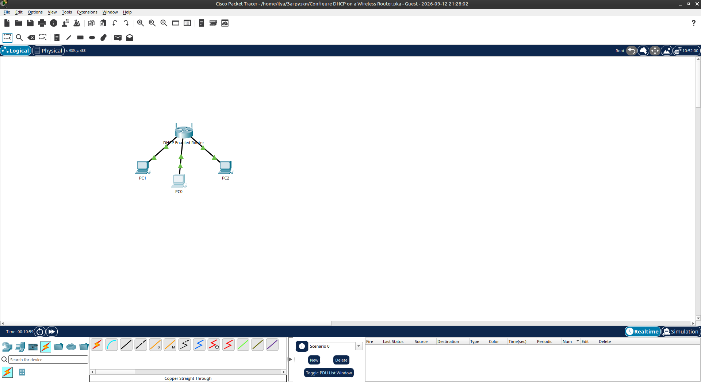
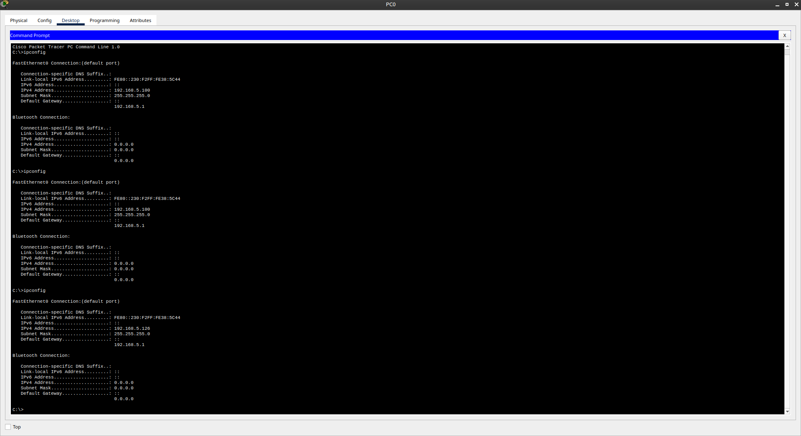
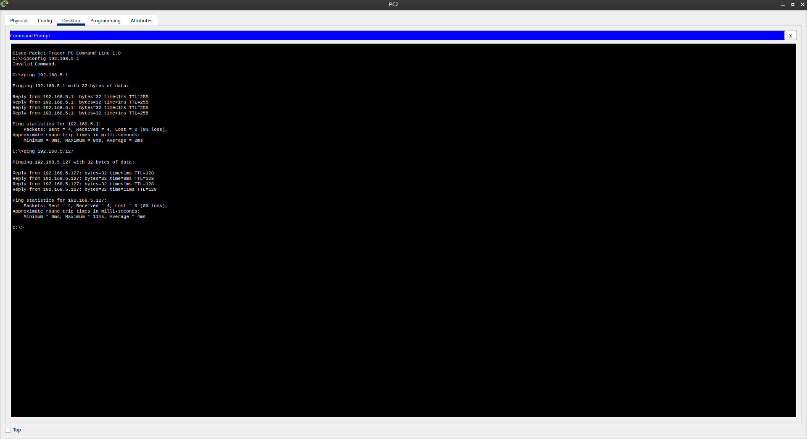

# Packet Tracer - Configure DHCP on a Wireless Router

Лабораторная работа выполнена в **Cisco Packet Tracer**.

Цель работы — подключить 3 ПК к беспроводному маршрутизатору, изменить диапазон DHCP и настроить клиентов на автоматическое получение IP-адресов.

## Топология сети

В лабораторной работе используются:

- DHCP Enabled Router (Wireless Router)
- PC0
- PC1
- PC2

Все компьютеры подключены к Ethernet-портам роутера кабелями **Copper Straight-Through**.



## 1. Подключение устройств

На первом этапе были добавлены 3 generic PC и соединены с беспроводным маршрутизатором:

- PC0 → Ethernet-порт роутера
- PC1 → Ethernet-порт роутера
- PC2 → Ethernet-порт роутера

После подключения индикаторы соединений стали зелёными.

## 2. Наблюдение настроек DHCP по умолчанию

На **PC0** через вкладку Desktop → IP Configuration был включён DHCP.

Роутер выдал адрес из стандартного пула. Шлюз по умолчанию:

```text
192.168.0.1
```

Через веб-браузер был открыт интерфейс роутера:

```text
http://192.168.0.1
```

Логин / пароль: `admin` / `admin`.

## 3. Изменение IP-адреса роутера

В разделе **Router IP Settings** IP-адрес роутера был изменён:

| Параметр     | Значение        |
|--------------|-----------------|
| Router IP    | `192.168.5.1`   |
| Subnet Mask  | `255.255.255.0` |

После сохранения настроек веб-интерфейс стал недоступен по старому адресу. На PC0 IP был обновлён (Static → DHCP).

Новый адрес для входа:

```text
http://192.168.5.1
```

## 4. Изменение диапазона DHCP

В настройках DHCP были изменены следующие параметры:

| Параметр                | Значение        |
|-------------------------|-----------------|
| Starting IP Address     | `192.168.5.126` |
| Maximum Number of Users | `75`            |

После сохранения настроек на PC0 снова был выполнен renew адреса (Static → DHCP).

## 5. Включение DHCP на остальных клиентах

На **PC1** и **PC2** через Desktop → IP Configuration был включён DHCP.

Клиенты получили адреса из нового пула.

## 6. Результаты

**PC0:**

| Параметр        | Значение        |
|-----------------|-----------------|
| IP Address      | `192.168.5.126` |
| Subnet Mask     | `255.255.255.0` |
| Default Gateway | `192.168.5.1`   |

**PC1:**

| Параметр        | Значение        |
|-----------------|-----------------|
| IP Address      | `192.168.5.127` |
| Subnet Mask     | `255.255.255.0` |
| Default Gateway | `192.168.5.1`   |

**PC2:**

| Параметр        | Значение         |
|-----------------|------------------|
| IP Address      | следующий в пуле |
| Subnet Mask     | `255.255.255.0`  |
| Default Gateway | `192.168.5.1`    |



## 7. Проверка связности

С **PC2** были выполнены команды:

```text
ping 192.168.5.1
ping 192.168.5.127
```

Оба пинга прошли успешно (0% packet loss).



## 8. Результат

- ✅ Подключены 3 ПК к Wireless Router
- ✅ Изменён LAN IP-адрес роутера на `192.168.5.1`
- ✅ Настроен новый диапазон DHCP (`192.168.5.126` + 75 пользователей)
- ✅ Все клиенты получают адреса автоматически
- ✅ Проверена IP-связность между устройствами

## Полученные навыки

В ходе лабораторной работы были отработаны:

- подключение устройств прямыми кабелями в Packet Tracer
- вход в веб-интерфейс Wireless Router
- изменение LAN IP-адреса роутера
- настройка DHCP-пула (Starting IP + Maximum Number of Users)
- автоматическое получение IPv4-адресов клиентами
- обновление адреса после смены IP роутера
- проверка связности командами `ipconfig` и `ping`

## Используемые технологии

```text
Cisco Packet Tracer
IPv4
DHCP
Wireless Router
Ethernet (Copper Straight-Through)
```

## Итог

Лабораторная работа демонстрирует базовую настройку DHCP на беспроводном маршрутизаторе и автоматическую выдачу адресов проводным клиентам.

## Проблемы

- После смены IP роутера на `192.168.5.1` старый адрес (`192.168.0.1`) перестаёт работать — необходимо обновить IP на клиенте.
- При смене диапазона DHCP клиенты начинают получать адреса начиная с `192.168.5.126`.
