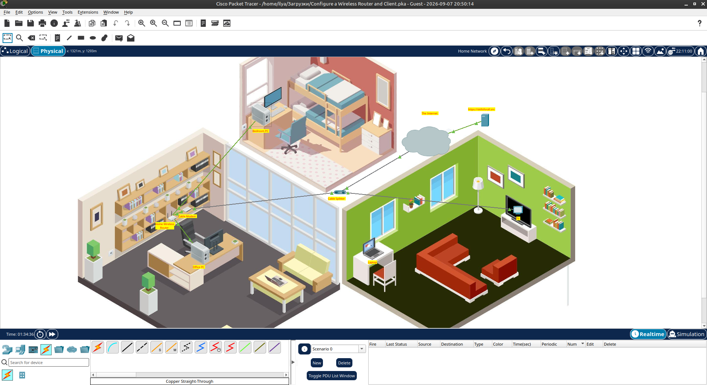
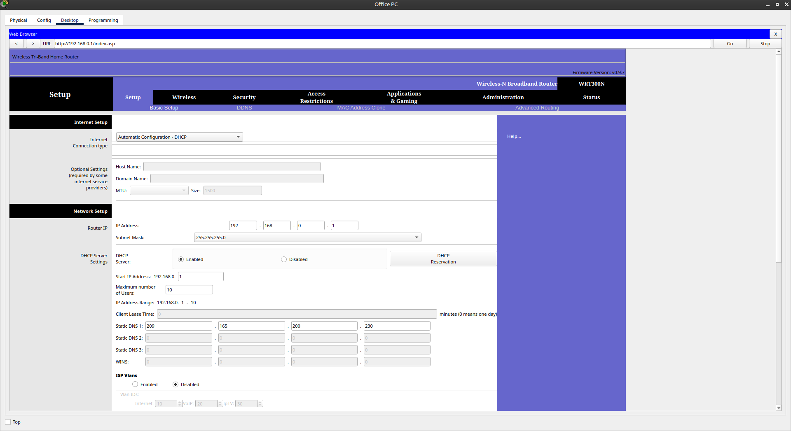
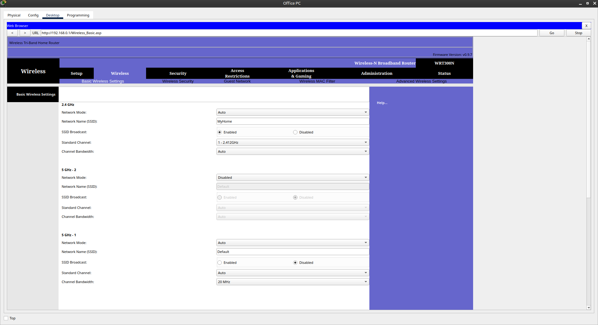
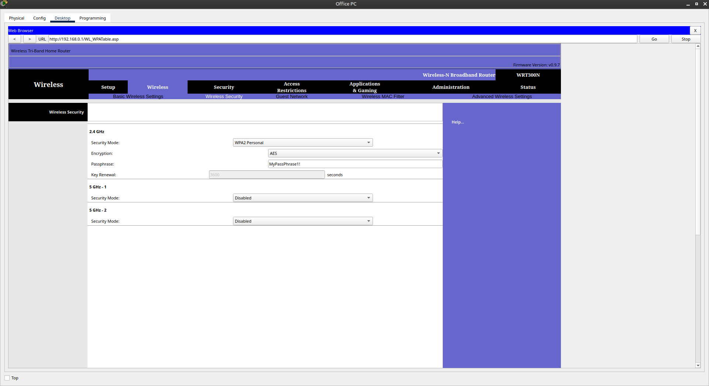

# 📡 Configure a Wireless Router and Clients

Лабораторная работа выполнена в **Cisco Packet Tracer**.

Цель работы — настроить домашнюю сеть с беспроводным маршрутизатором, DHCP и Wi-Fi-клиентом, а затем проверить сетевое соединение между устройствами.

##  Топология сети

В лабораторной работе используются:

- Wireless Router
- Cable Modem
- Cable Splitter
- Office PC
- Bedroom PC
- Laptop
- TV
- Internet / Server



## 1. Подключение устройств

На первом этапе устройства были соединены в соответствии с топологией домашней сети.

Основные подключения:

- Cable Splitter → Cable Modem
- Cable Splitter → TV
- Cable Modem → Wireless Router
- Office PC → Wireless Router
- Bedroom PC → Wireless Router
- Laptop → Wireless Router по Wi-Fi

## 2. Настройка Wireless Router

Для настройки маршрутизатора использовался **Office PC**.

В браузере был открыт веб-интерфейс:

```text
http://192.168.0.1
```

Параметры локальной сети:

| Параметр | Значение |
|---|---|
| Router IP | `192.168.0.1` |
| Subnet Mask | `255.255.255.0` |
| DHCP Server | Enabled |
| Maximum Users | `10` |
| DHCP Range | `192.168.0.1 – 192.168.0.10` |



## 3. Настройка Wi-Fi

Для беспроводной сети настроен диапазон **2.4 GHz**.

| Параметр | Значение |
|---|---|
| Network Mode | Auto |
| SSID | `MyHome` |
| SSID Broadcast | Enabled |
| Standard Channel | `1 - 2.412 GHz` |
| Channel Bandwidth | Auto |



После настройки маршрутизатор транслирует беспроводную сеть с именем **MyHome**.

## 4. Настройка безопасности

Для защиты Wi-Fi используется **WPA2 Personal**.

| Параметр | Значение |
|---|---|
| Security Mode | WPA2 Personal |
| Encryption | AES |
| Passphrase | `MyPassPhrase1!` |



## 5. Подключение клиентов

### Office PC

Office PC используется для настройки маршрутизатора и получает сетевые параметры через DHCP.

### Bedroom PC

Bedroom PC подключён к маршрутизатору по Ethernet и получает IP-адрес автоматически.

### Laptop

Laptop подключается к беспроводной сети:

```text
SSID: MyHome
Password: MyPassPhrase1!
```

После подключения клиент получает сетевые параметры от DHCP-сервера.

## 6. Проверка подключения

После настройки была проверена работоспособность сети:

- получение IP-адресов через DHCP;
- наличие шлюза по умолчанию;
- подключение Laptop к Wi-Fi;
- подключение проводных компьютеров;
- доступ к сетевому серверу.

## 7. Результат

- ✅ Подключены сетевые устройства
- ✅ Настроен Wireless Router
- ✅ Настроен DHCP
- ✅ Создана Wi-Fi сеть `MyHome`
- ✅ Настроена защита WPA2 Personal
- ✅ Использовано шифрование AES
- ✅ Laptop подключён по Wi-Fi
- ✅ Проводные компьютеры подключены к маршрутизатору
- ✅ Проверена IP-связность устройств

##  Полученные навыки

В ходе лабораторной работы были отработаны:

- настройка домашнего маршрутизатора;
- настройка DHCP;
- автоматическое получение IPv4-адресов;
- настройка SSID;
- подключение беспроводных клиентов;
- настройка WPA2 Personal;
- использование AES;
- проверка сетевого подключения;
- работа с веб-интерфейсом Wireless Router.

##  Используемые технологии

```text
Cisco Packet Tracer
IPv4
DHCP
Wi-Fi
WPA2 Personal
AES
Wireless Router
Ethernet
```

##  Итог

Лабораторная работа демонстрирует настройку небольшой домашней сети с проводными и беспроводными клиентами.

##  Проблемы
- Laptop не выходил в сеть,он изначально был в Static,перевод в DHCP и перезагрузка IP помогла.

