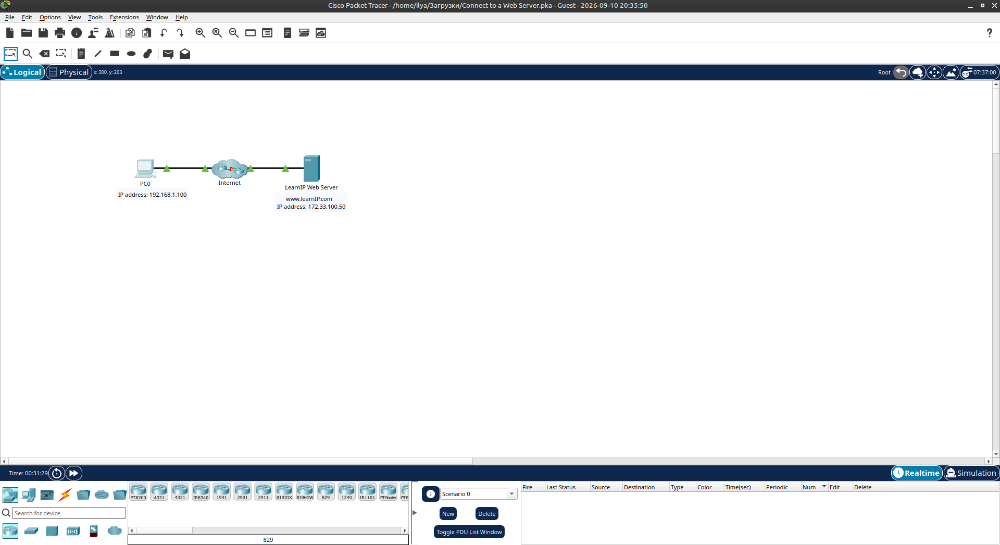
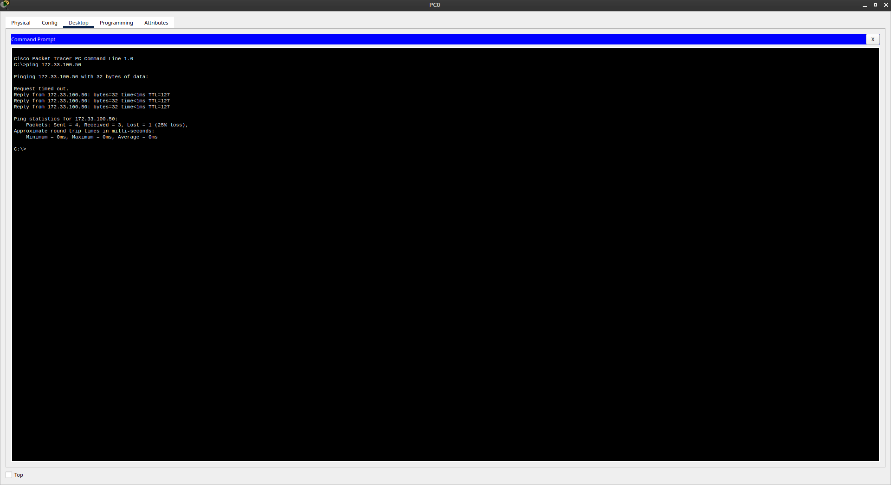
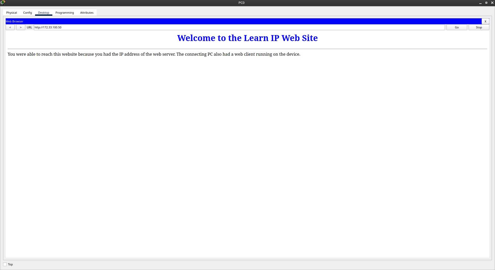

#  Connect to a Web Server

Лабораторная работа выполнена в **Cisco Packet Tracer**.

Цель — проверить сетевое соединение с Web Server и получить доступ к веб-странице через IP-адрес сервера.

---

##  Цель работы

- проверить доступность Web Server;
- использовать команду `ping`;
- определить, проходит ли IP-соединение между PC0 и сервером;
- открыть веб-сервер через Web Browser;
- увидеть результат передачи данных по IP.

---

## Топология



## 1. Проверка подключения

На компьютере **PC0** был открыт:

**Desktop → Command Prompt**

Для проверки соединения выполнена команда:

```text
ping 172.33.100.50
```

IP-адрес Web Server:

```text
172.33.100.50
```

### Результат Ping



Получены ответы от сервера:

```text
Reply from 172.33.100.50
```

В результате:

```text
Sent = 4
Received = 3
Lost = 1 (25% loss)
```

Первый запрос мог завершиться тайм-аутом из-за первоначального формирования ARP-записи и загрузки устройств.

---

## 2. Подключение к Web Server

После проверки IP-связности на PC0 был открыт:

**Desktop → Web Browser**

В адресную строку введён IP-адрес:

```text
172.33.100.50
```

### Результат



Web Browser успешно открыл страницу:

**Welcome to the Learn IP Web Site**

Это подтверждает, что PC0 имеет IP-связность с Web Server и может обращаться к нему по IP-адресу.

---

##  Проверка

| Проверка | Результат |
|---|---|
| Ping Web Server | ✅ Успешно |
| Web Server IP | `172.33.100.50` |
| Web Browser | ✅ Работает |
| Web Page | ✅ Открыта |
| PC0 → Server | ✅ Доступ есть |

---

##  Полученные навыки

В лабораторной работе были отработаны:

- работа с Command Prompt в Cisco Packet Tracer;
- использование `ping`;
- проверка IP-связности;
- работа с IP-адресами;
- использование Web Browser;
- понимание связи между IP-адресом и доступом к Web Server;
- базовая диагностика сетевого соединения.

---

## 🛠 Используемые технологии

```text
Cisco Packet Tracer
IPv4
ICMP
Ping
HTTP
Web Server
Web Browser
ARP
```
---


##  Итог

PC0 успешно установил соединение с Web Server по адресу `172.33.100.50`.

После проверки через `ping` веб-страница сервера была успешно открыта в браузере.

## Проблемы

- Отсутствуют
