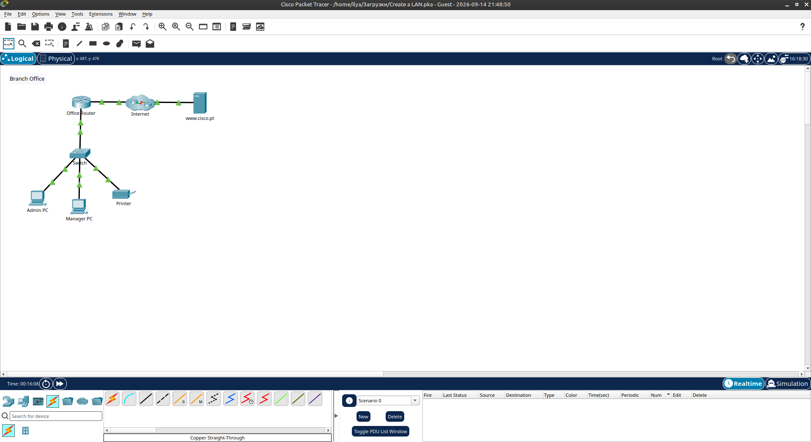
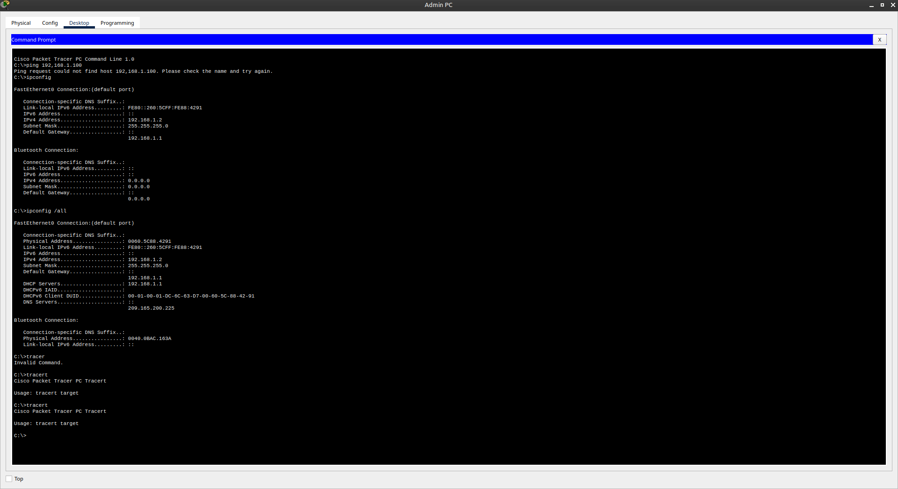
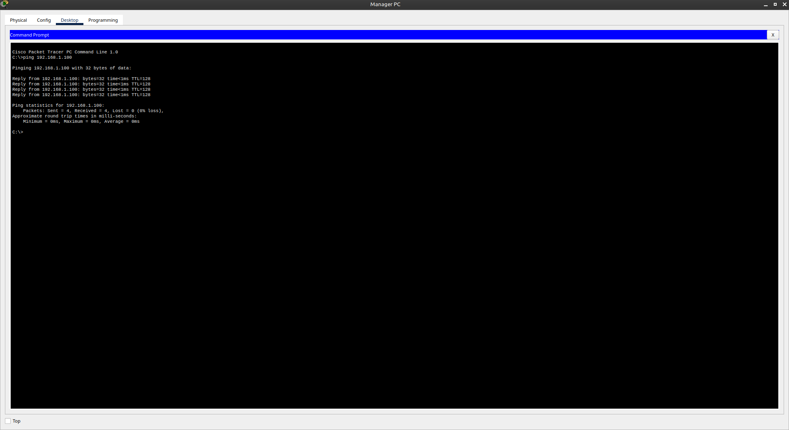
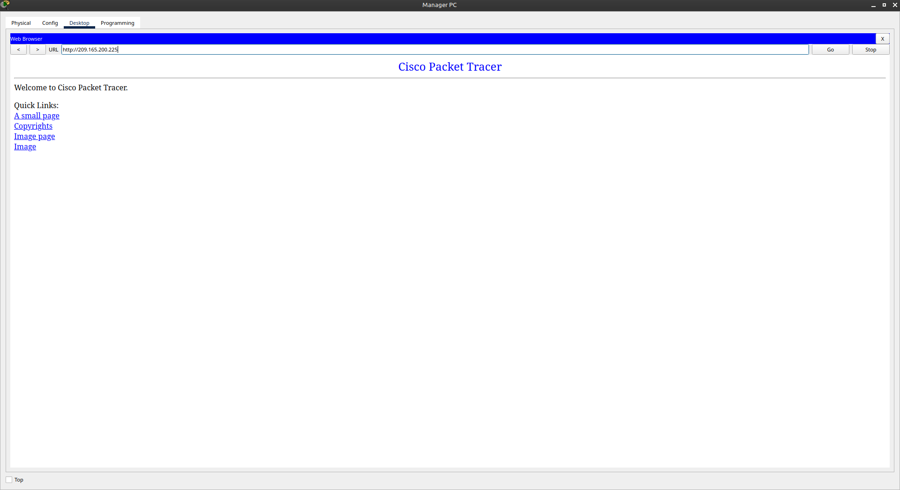
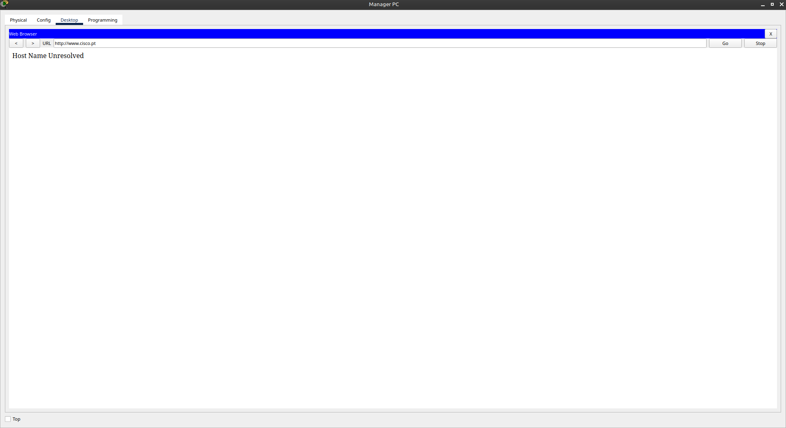

# Packet Tracer - Create a LAN

Лабораторная работа выполнена в **Cisco Packet Tracer**.

Цель работы — создать небольшую локальную сеть (LAN) филиала, подключить устройства к коммутатору и роутеру, настроить IP-адресацию и проверить связность.

## Топология сети

В лабораторной работе используются:

- Office Router
- Switch
- Admin PC
- Manager PC
- Printer
- Internet / www.cisco.pt



## 1. Подключение устройств

Устройства подключены следующим образом:

- Admin PC → Switch (Copper Straight-Through)
- Manager PC → Switch
- Printer → Switch
- Switch → Office Router
- Office Router → Internet

После подключения индикаторы соединений стали зелёными.

## 2. Настройка IP-адресации

На **Admin PC** и **Manager PC** использовался DHCP.

**Admin PC:**

| Параметр        | Значение              |
|-----------------|-----------------------|
| IP Address      | `192.168.1.2`         |
| Subnet Mask     | `255.255.255.0`       |
| Default Gateway | `192.168.1.1`         |
| DNS Server      | `209.165.200.225`     |

**Printer:**

| Параметр        | Значение              |
|-----------------|-----------------------|
| IP Address      | `192.168.1.100`       |



## 3. Проверка связности

С **Manager PC** выполнен ping к принтеру:

```text
ping 192.168.1.100
```

Результат: успешно (0% packet loss).



Доступ к веб-серверу по IP-адресу:

```text
http://209.165.200.225
```

Страница открылась успешно.



Попытка открыть сайт по имени:

```text
http://www.cisco.pt
```

Результат: **Host Name Unresolved** (проблема с DNS).



## 4. Результаты

| Устройство   | IP Address      | Gateway       | Результат                  |
|--------------|-----------------|---------------|----------------------------|
| Admin PC     | 192.168.1.2     | 192.168.1.1   | Связность есть             |
| Manager PC   | (DHCP/Static)   | 192.168.1.1   | Ping к принтеру успешен    |
| Printer      | 192.168.1.100   | —             | Доступен по сети           |
| Web Server   | 209.165.200.225 | —             | Доступен по IP             |

## 5. Результат

- ✅ Создана топология LAN филиала
- ✅ Подключены PC, принтер, switch и router
- ✅ Настроена IP-адресация
- ✅ Проверена локальная связность (ping)
- ✅ Проверен доступ в интернет по IP
- ✅ Выявлена проблема разрешения имён (DNS)

## Полученные навыки

В ходе лабораторной работы были отработаны:

- создание простой LAN-топологии в Packet Tracer
- подключение устройств кабелями Copper Straight-Through
- настройка IP-адресов (DHCP / static)
- использование команд `ipconfig`, `ipconfig /all`, `ping`
- проверка доступа к веб-серверу
- понимание роли DNS при обращении по имени

## Используемые технологии

```text
Cisco Packet Tracer
IPv4
DHCP
DNS
Ethernet
ICMP (ping)
Web Browser
```

## Итог

Лабораторная работа показывает базовый процесс создания локальной сети небольшого офиса: подключение устройств, настройка адресации и проверка связности как внутри сети, так и с внешними ресурсами.

## Проблемы

- При обращении к `www.cisco.pt` появляется ошибка **Host Name Unresolved** — DNS-сервер недоступен или неверно настроен.
- Для доступа к веб-серверу использовался IP-адрес `209.165.200.225`.
