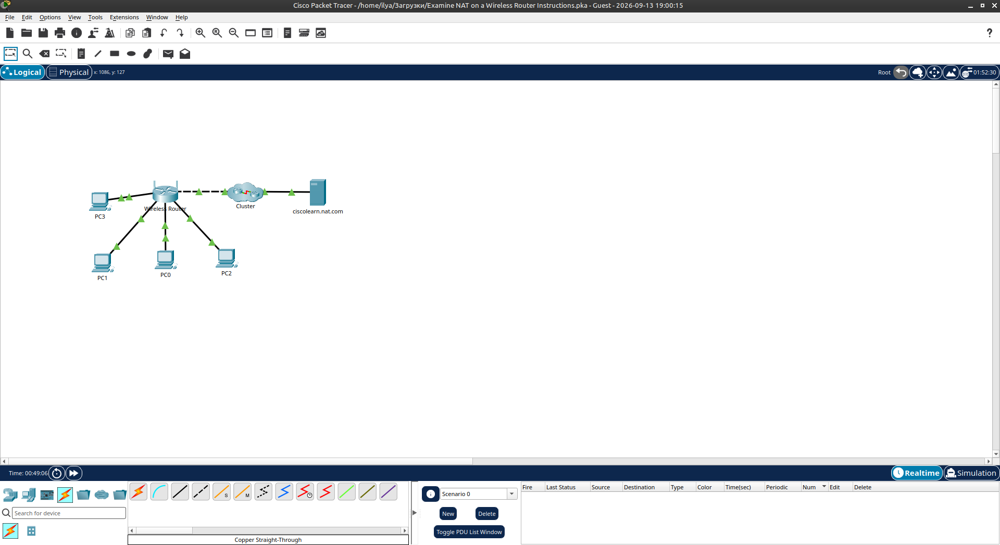
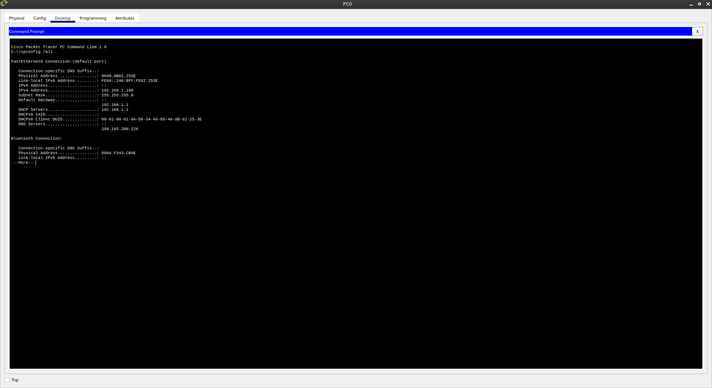
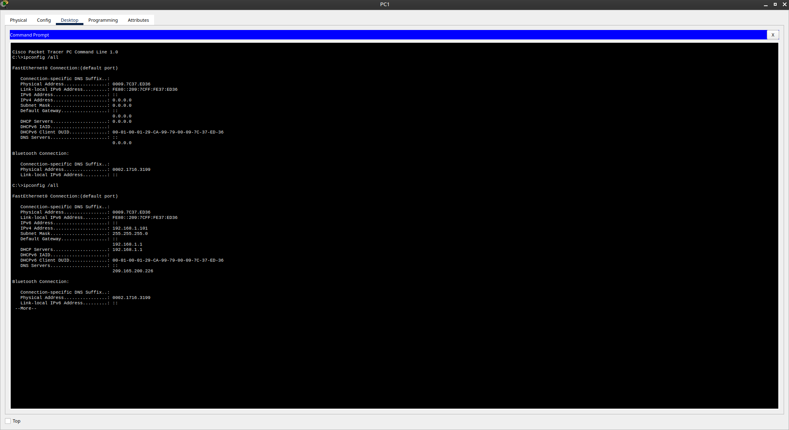
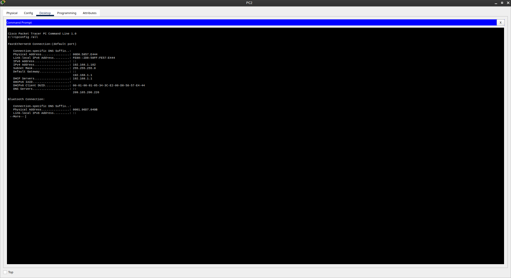
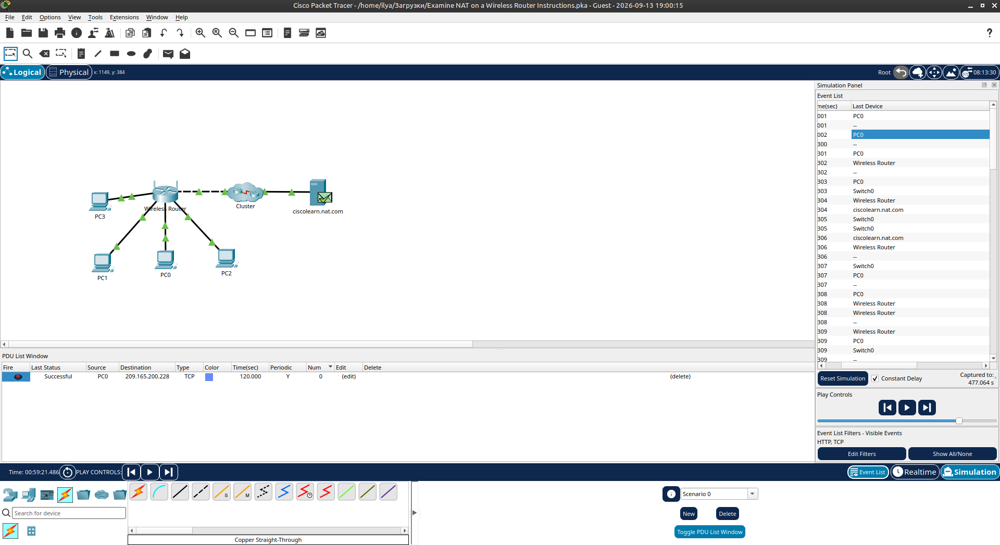
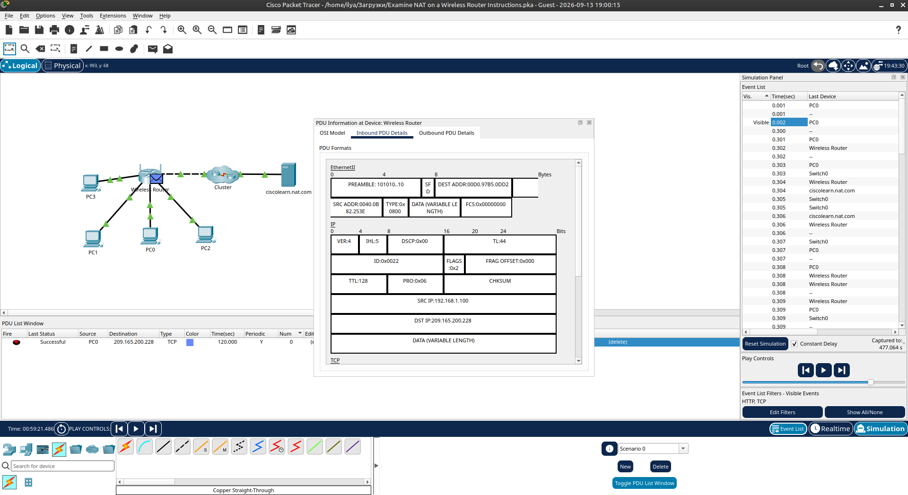
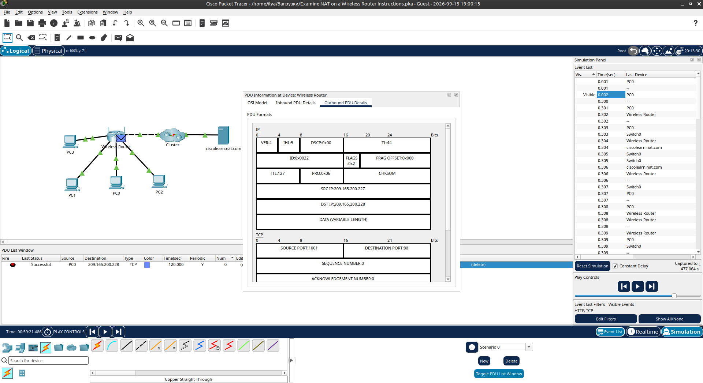
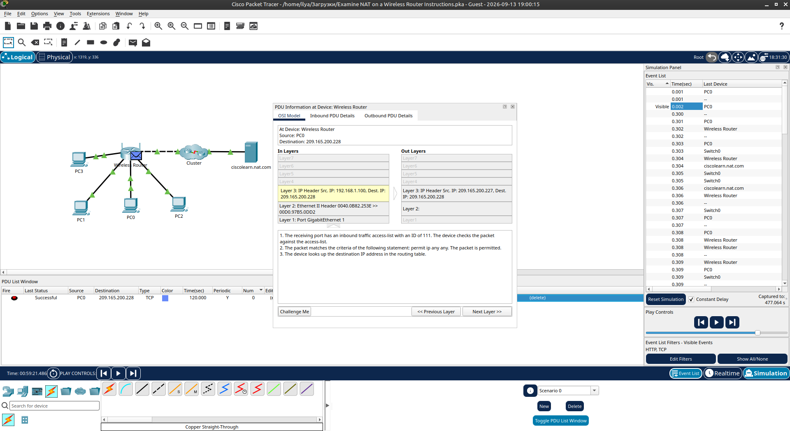

# Packet Tracer - Examine NAT on a Wireless Router

Лабораторная работа выполнена в **Cisco Packet Tracer**.

Цель работы — изучить работу NAT на беспроводном маршрутизаторе, подключить 4 ПК через DHCP и проследить, как частные адреса преобразуются в публичные при выходе в интернет.

## Топология сети

В лабораторной работе используются:

- Wireless Router
- PC0, PC1, PC2, PC3
- Cluster (интернет)
- ciscolearn.nat.com (веб-сервер)

Все компьютеры подключены к Ethernet-портам роутера кабелями **Copper Straight-Through**. Роутер подключён к интернету через Cluster.



## 1. Подключение первого ПК и получение адреса

Добавлен **PC0** и подключён к беспроводному маршрутизатору.

На PC0 через Desktop → IP Configuration включён **DHCP**.

Полученные параметры:

| Параметр        | Значение          |
|-----------------|-------------------|
| IP Address      | `192.168.1.100`   |
| Subnet Mask     | `255.255.255.0`   |
| Default Gateway | `192.168.1.1`     |
| DNS Server      | `209.165.200.226` |



## 2. Вход в веб-интерфейс роутера

Через веб-браузер открыт интерфейс роутера:

```text
http://192.168.1.1
```

Логин / пароль: `admin` / `admin`.

В разделе **Status → Router** проверен адрес интернет-подключения (WAN IP), выданный провайдером.

## 3. Подключение остальных ПК

Добавлены **PC1**, **PC2** и **PC3**. Все подключены прямыми кабелями и получили адреса по DHCP.

**PC1:**

| Параметр        | Значение          |
|-----------------|-------------------|
| IP Address      | `192.168.1.101`   |
| Subnet Mask     | `255.255.255.0`   |
| Default Gateway | `192.168.1.1`     |



**PC2:**

| Параметр        | Значение          |
|-----------------|-------------------|
| IP Address      | `192.168.1.102`   |
| Subnet Mask     | `255.255.255.0`   |
| Default Gateway | `192.168.1.1`     |



**PC3:**

| Параметр        | Значение          |
|-----------------|-------------------|
| IP Address      | `192.168.1.103`   |
| Subnet Mask     | `255.255.255.0`   |
| Default Gateway | `192.168.1.1`     |


Все устройства получили **частные (private)** адреса из сети `192.168.1.0/24`.  
Частные адреса не маршрутизируются в интернете — для выхода наружу необходим **NAT**.

## 4. Просмотр NAT-трансляции в режиме Simulation

Переключено в режим **Simulation**.

Создан Complex PDU:

- Application: **HTTP**
- Source: PC0
- Destination: `ciscolearn.nat.com`
- Source Port: `1000`
- Periodic: 120 секунд

Трафик успешно проходит через роутер к серверу.



## 5. Анализ заголовков пакетов

### Inbound PDU (пакет, входящий в роутер от PC0)

| Поле            | Значение            |
|-----------------|---------------------|
| SRC IP          | `192.168.1.100`     |
| DST IP          | `209.165.200.228`   |



### Outbound PDU (пакет, выходящий из роутера в интернет)

| Поле            | Значение            |
|-----------------|---------------------|
| SRC IP          | `209.165.200.227`   |
| DST IP          | `209.165.200.228`   |



### PDU Information (сравнение слоёв)

На уровне Layer 3 видно изменение:

- **In Layers**: SRC `192.168.1.100` → DST `209.165.200.228`
- **Out Layers**: SRC `209.165.200.227` → DST `209.165.200.228`



Роутер выполнил **NAT (Network Address Translation)** — заменил частный адрес клиента на свой публичный WAN-адрес.

## 6. Результат

- ✅ Подключены 4 ПК к Wireless Router
- ✅ Все клиенты получили адреса по DHCP (частные адреса)
- ✅ Изучен WAN IP роутера
- ✅ В режиме Simulation прослежен HTTP-трафик
- ✅ Подтверждена работа NAT: `192.168.1.100` → `209.165.200.227`

## Полученные навыки

В ходе лабораторной работы были отработаны:

- подключение нескольких ПК к Wireless Router
- получение адресов по DHCP
- вход в веб-интерфейс роутера и просмотр WAN-статуса
- работа в режиме Simulation Packet Tracer
- создание Complex PDU (HTTP)
- анализ Inbound / Outbound PDU
- понимание принципа работы NAT на домашнем маршрутизаторе

## Используемые технологии

```text
Cisco Packet Tracer
IPv4
DHCP
NAT (Network Address Translation)
Wireless Router
HTTP
Simulation Mode
```

## Итог

Лабораторная работа наглядно демонстрирует, как беспроводной маршрутизатор с помощью NAT позволяет устройствам с частными адресами получать доступ к ресурсам в интернете, подменяя исходный IP-адрес на публичный адрес роутера.

## Проблемы

- Без NAT частные адреса (`192.168.x.x`) не могут выходить в интернет.
- При анализе пакетов важно сравнивать именно Inbound и Outbound PDU на роутере — именно там происходит трансляция.
