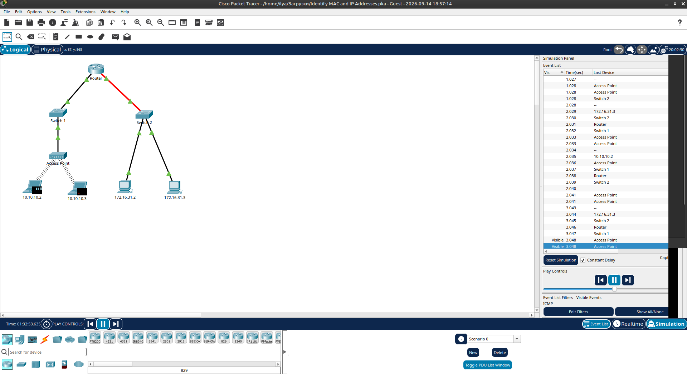
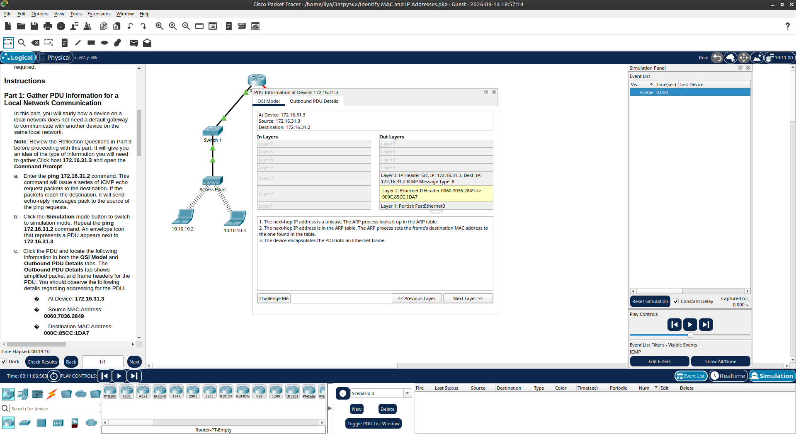
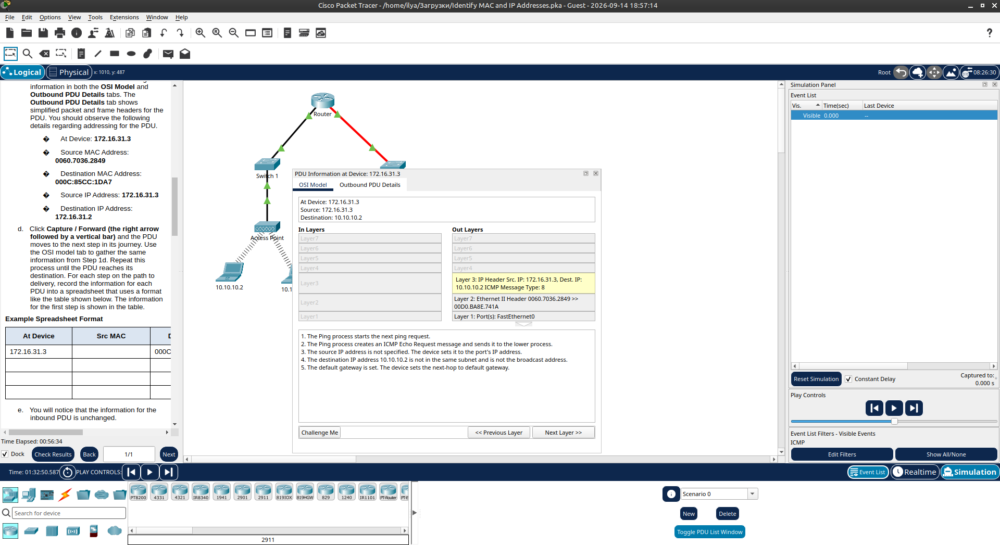
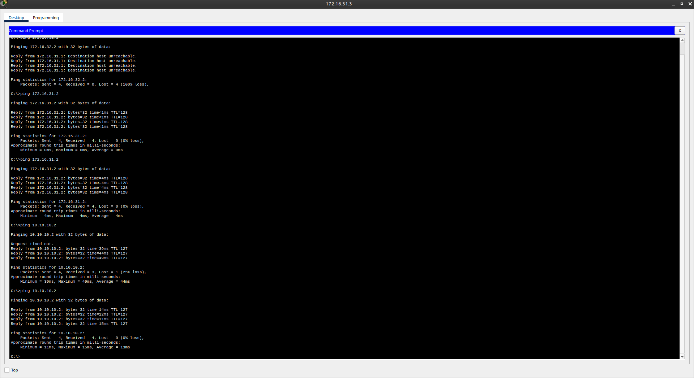

# Packet Tracer - Identify MAC and IP Addresses

Лабораторная работа выполнена в **Cisco Packet Tracer**.

Цель работы — изучить, как меняются MAC- и IP-адреса в PDU при передаче данных в локальной и удалённой сети.

## Топология сети

В лабораторной работе используются:

- Router
- Switch 1
- Switch 2
- Access Point
- Хосты: `10.10.10.2`, `10.10.10.3` (беспроводное подключение)
- Хосты: `172.16.31.2`, `172.16.31.3` (проводное подключение)



## 1. Локальная сеть (Local Network Communication)

На хосте **172.16.31.3** выполнен ping к устройству в той же сети:

```text
ping 172.16.31.2
```

Пинг прошёл успешно (0% packet loss).

В режиме **Simulation** просмотрены PDU. На исходном устройстве:

| Параметр              | Значение            |
|-----------------------|---------------------|
| At Device             | `172.16.31.3`       |
| Source MAC Address    | `0060.7036.2849`    |
| Destination MAC Address | `000C.85CC.1DA7`  |
| Source IP Address     | `172.16.31.3`       |
| Destination IP Address| `172.16.31.2`       |

При передаче в локальной сети **IP-адреса не меняются**, а MAC-адреса меняются на каждом участке (источник → следующий хоп).



## 2. Удалённая сеть (Remote Network Communication)

С хоста **172.16.31.3** выполнен ping к устройству в другой сети:

```text
ping 10.10.10.2
```

После нескольких попыток пинг прошёл успешно.

В режиме Simulation видно, что:

- На исходном хосте Destination MAC — это MAC шлюза (роутера)
- На роутере происходит замена Source MAC и Destination MAC
- IP-адреса (Source и Destination) остаются неизменными на всём пути



## 3. Проверка связности

Результаты команд `ping` с хоста `172.16.31.3`:

| Назначение      | Результат                  |
|-----------------|----------------------------|
| `172.16.31.2`   | Успешно (0% loss)          |
| `172.16.31.2`   | Успешно (0% loss)          |
| `10.10.10.2`    | Успешно (после ARP)        |



## 4. Ключевые выводы

- В **локальной сети** устройство общается напрямую (по MAC), шлюз не нужен.
- В **удалённой сети** пакет сначала отправляется на default gateway (роутер).
- **IP-адреса** (Layer 3) не меняются на всём пути от источника до назначения.
- **MAC-адреса** (Layer 2) меняются на каждом участке сети (hop-by-hop).
- Роутер соединяет две разные IP-сети: `10.10.10.0/24` и `172.16.31.0/24`.

## 5. Результат

- ✅ Изучена передача PDU в локальной сети
- ✅ Изучена передача PDU в удалённой сети
- ✅ Зафиксированы изменения MAC-адресов
- ✅ Подтверждено, что IP-адреса остаются неизменными
- ✅ Проверена связность между сетями через роутер

## Полученные навыки

В ходе лабораторной работы были отработаны:

- работа в режиме Simulation Packet Tracer
- анализ заголовков Ethernet и IP в PDU
- понимание разницы между локальной и удалённой передачей
- роль default gateway
- изменение MAC-адресов на каждом участке пути
- неизменность IP-адресов на всём пути пакета

## Используемые технологии

```text
Cisco Packet Tracer
IPv4
Ethernet
MAC Addressing
ICMP (ping)
OSI Model (Layer 2 & Layer 3)
ARP
```

## Итог

Лабораторная работа наглядно показывает, как работают адресация на канальном и сетевом уровнях при передаче данных внутри одной сети и между разными сетями через маршрутизатор.

## Проблемы

- При первом ping к удалённой сети (`10.10.10.2`) часть пакетов терялась (ARP-запрос).
- Красный линк на топологии между Router и Switch 2 указывает на возможную проблему порта (в данной работе не мешало).# Packet Tracer - Identify MAC and IP Addresses

Лабораторная работа выполнена в **Cisco Packet Tracer**.

Цель работы — изучить, как меняются MAC- и IP-адреса в PDU при передаче данных в локальной и удалённой сети.

## Топология сети

В лабораторной работе используются:

- Router
- Switch 1
- Switch 2
- Access Point
- Хосты: `10.10.10.2`, `10.10.10.3` (беспроводное подключение)
- Хосты: `172.16.31.2`, `172.16.31.3` (проводное подключение)


## 1. Локальная сеть (Local Network Communication)

На хосте **172.16.31.3** выполнен ping к устройству в той же сети:

```text
ping 172.16.31.2
```

Пинг прошёл успешно (0% packet loss).

В режиме **Simulation** просмотрены PDU. На исходном устройстве:

| Параметр              | Значение            |
|-----------------------|---------------------|
| At Device             | `172.16.31.3`       |
| Source MAC Address    | `0060.7036.2849`    |
| Destination MAC Address | `000C.85CC.1DA7`  |
| Source IP Address     | `172.16.31.3`       |
| Destination IP Address| `172.16.31.2`       |

При передаче в локальной сети **IP-адреса не меняются**, а MAC-адреса меняются на каждом участке (источник → следующий хоп).


## 2. Удалённая сеть (Remote Network Communication)

С хоста **172.16.31.3** выполнен ping к устройству в другой сети:

```text
ping 10.10.10.2
```

После нескольких попыток пинг прошёл успешно.

В режиме Simulation видно, что:

- На исходном хосте Destination MAC — это MAC шлюза (роутера)
- На роутере происходит замена Source MAC и Destination MAC
- IP-адреса (Source и Destination) остаются неизменными на всём пути


## 3. Проверка связности

Результаты команд `ping` с хоста `172.16.31.3`:

| Назначение      | Результат                  |
|-----------------|----------------------------|
| `172.16.31.2`   | Успешно (0% loss)          |
| `172.16.31.2`   | Успешно (0% loss)          |
| `10.10.10.2`    | Успешно (после ARP)        |


## 4. Ключевые выводы

- В **локальной сети** устройство общается напрямую (по MAC), шлюз не нужен.
- В **удалённой сети** пакет сначала отправляется на default gateway (роутер).
- **IP-адреса** (Layer 3) не меняются на всём пути от источника до назначения.
- **MAC-адреса** (Layer 2) меняются на каждом участке сети (hop-by-hop).
- Роутер соединяет две разные IP-сети: `10.10.10.0/24` и `172.16.31.0/24`.

## 5. Результат

- ✅ Изучена передача PDU в локальной сети
- ✅ Изучена передача PDU в удалённой сети
- ✅ Зафиксированы изменения MAC-адресов
- ✅ Подтверждено, что IP-адреса остаются неизменными
- ✅ Проверена связность между сетями через роутер

## Полученные навыки

В ходе лабораторной работы были отработаны:

- работа в режиме Simulation Packet Tracer
- анализ заголовков Ethernet и IP в PDU
- понимание разницы между локальной и удалённой передачей
- роль default gateway
- изменение MAC-адресов на каждом участке пути
- неизменность IP-адресов на всём пути пакета

## Используемые технологии

```text
Cisco Packet Tracer
IPv4
Ethernet
MAC Addressing
ICMP (ping)
OSI Model (Layer 2 & Layer 3)
ARP
```

## Итог

Лабораторная работа наглядно показывает, как работают адресация на канальном и сетевом уровнях при передаче данных внутри одной сети и между разными сетями через маршрутизатор.

## Проблемы

- При первом ping к удалённой сети (`10.10.10.2`) часть пакетов терялась (ARP-запрос).
- Красный линк на топологии между Router и Switch 2 указывает на возможную проблему порта (в данной работе не мешало).# Packet Tracer - Identify MAC and IP Addresses

Лабораторная работа выполнена в **Cisco Packet Tracer**.

Цель работы — изучить, как меняются MAC- и IP-адреса в PDU при передаче данных в локальной и удалённой сети.

## Топология сети

В лабораторной работе используются:

- Router
- Switch 1
- Switch 2
- Access Point
- Хосты: `10.10.10.2`, `10.10.10.3` (беспроводное подключение)
- Хосты: `172.16.31.2`, `172.16.31.3` (проводное подключение)


## 1. Локальная сеть (Local Network Communication)

На хосте **172.16.31.3** выполнен ping к устройству в той же сети:

```text
ping 172.16.31.2
```

Пинг прошёл успешно (0% packet loss).

В режиме **Simulation** просмотрены PDU. На исходном устройстве:

| Параметр              | Значение            |
|-----------------------|---------------------|
| At Device             | `172.16.31.3`       |
| Source MAC Address    | `0060.7036.2849`    |
| Destination MAC Address | `000C.85CC.1DA7`  |
| Source IP Address     | `172.16.31.3`       |
| Destination IP Address| `172.16.31.2`       |

При передаче в локальной сети **IP-адреса не меняются**, а MAC-адреса меняются на каждом участке (источник → следующий хоп).


## 2. Удалённая сеть (Remote Network Communication)

С хоста **172.16.31.3** выполнен ping к устройству в другой сети:

```text
ping 10.10.10.2
```

После нескольких попыток пинг прошёл успешно.

В режиме Simulation видно, что:

- На исходном хосте Destination MAC — это MAC шлюза (роутера)
- На роутере происходит замена Source MAC и Destination MAC
- IP-адреса (Source и Destination) остаются неизменными на всём пути


## 3. Проверка связности

Результаты команд `ping` с хоста `172.16.31.3`:

| Назначение      | Результат                  |
|-----------------|----------------------------|
| `172.16.31.2`   | Успешно (0% loss)          |
| `172.16.31.2`   | Успешно (0% loss)          |
| `10.10.10.2`    | Успешно (после ARP)        |


## 4. Ключевые выводы

- В **локальной сети** устройство общается напрямую (по MAC), шлюз не нужен.
- В **удалённой сети** пакет сначала отправляется на default gateway (роутер).
- **IP-адреса** (Layer 3) не меняются на всём пути от источника до назначения.
- **MAC-адреса** (Layer 2) меняются на каждом участке сети (hop-by-hop).
- Роутер соединяет две разные IP-сети: `10.10.10.0/24` и `172.16.31.0/24`.

## 5. Результат

- ✅ Изучена передача PDU в локальной сети
- ✅ Изучена передача PDU в удалённой сети
- ✅ Зафиксированы изменения MAC-адресов
- ✅ Подтверждено, что IP-адреса остаются неизменными
- ✅ Проверена связность между сетями через роутер

## Полученные навыки

В ходе лабораторной работы были отработаны:

- работа в режиме Simulation Packet Tracer
- анализ заголовков Ethernet и IP в PDU
- понимание разницы между локальной и удалённой передачей
- роль default gateway
- изменение MAC-адресов на каждом участке пути
- неизменность IP-адресов на всём пути пакета

## Используемые технологии

```text
Cisco Packet Tracer
IPv4
Ethernet
MAC Addressing
ICMP (ping)
OSI Model (Layer 2 & Layer 3)
ARP
```

## Итог

Лабораторная работа наглядно показывает, как работают адресация на канальном и сетевом уровнях при передаче данных внутри одной сети и между разными сетями через маршрутизатор.

## Проблемы

- При первом ping к удалённой сети (`10.10.10.2`) часть пакетов терялась (ARP-запрос).
- Красный линк на топологии между Router и Switch 2 указывает на возможную проблему порта (в данной работе не мешало).
