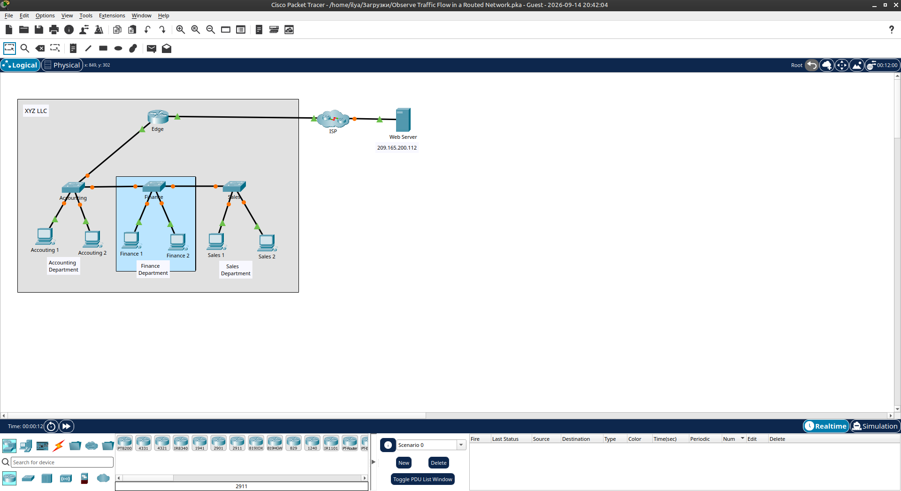
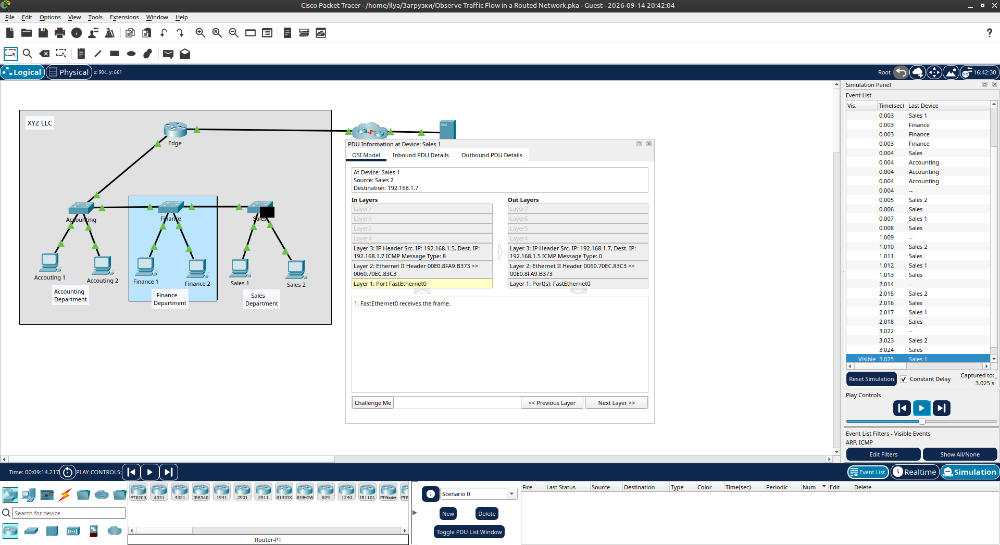
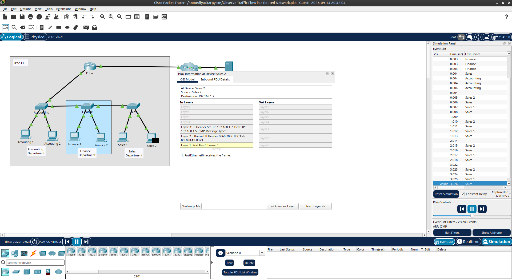
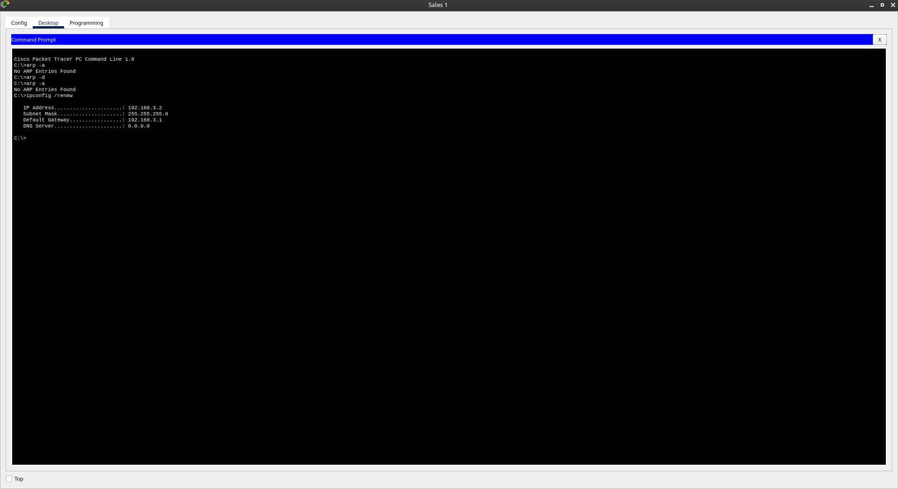
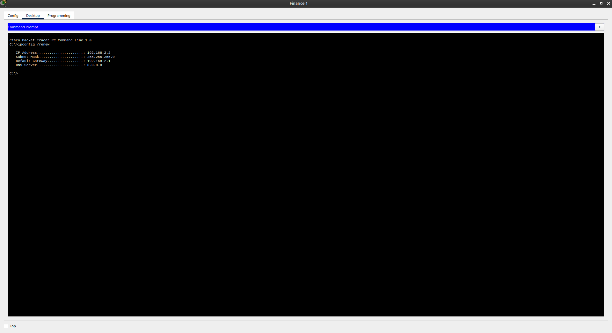
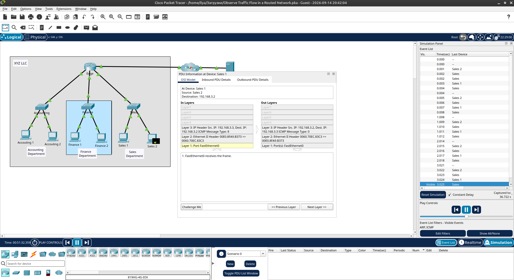

# Packet Tracer - Observe Traffic Flow in a Routed Network

Лабораторная работа выполнена в **Cisco Packet Tracer**.

Цель работы — продемонстрировать, как разделение сети на подсети с маршрутизацией повышает эффективность сети за счёт локализации трафика.

## Топология сети

В лабораторной работе используются:

- Edge Router
- Switch Accounting
- Switch Finance
- Switch Sales
- Хосты: Accounting 1/2, Finance 1/2, Sales 1/2
- ISP / Web Server (`209.165.200.112`)



## 1. Наблюдение трафика в неразделённой сети (Unrouted LAN)

Изначально вся компания работает в одной сети. Все отделы находятся в одном IP-диапазоне.

На **Sales 1** очищен ARP-кэш:

```text
arp -d
```

Затем выполнен ping к **Sales 2**.

Поскольку ARP-кэш был пуст, хост отправил **ARP Request** (broadcast):

- Source MAC — MAC-адрес Sales 1
- Destination MAC — `FFFF.FFFF.FFFF` (broadcast)
- Source IP — IP Sales 1
- Destination IP — IP Sales 2

Этот broadcast обрабатывается **всеми хостами** и интерфейсом роутера в сети.





## 2. Реконфигурация сети (Routed Network)

Сеть была разделена на отдельные подсети для отделов:

| Отдел      | Сеть            | Шлюз          |
|------------|-----------------|---------------|
| Finance    | `192.168.2.0/24`| `192.168.2.1`  |
| Sales      | `192.168.3.0/24`| `192.168.3.1`  |

После изменения IP-адресов на хостах выполнен `ipconfig /renew`.

**Sales 1:**

| Параметр        | Значение        |
|-----------------|-----------------|
| IP Address      | `192.168.3.2`   |
| Subnet Mask     | `255.255.255.0` |
| Default Gateway | `192.168.3.1`   |



**Finance 1:**

| Параметр        | Значение        |
|-----------------|-----------------|
| IP Address      | `192.168.2.2`   |
| Subnet Mask     | `255.255.255.0` |
| Default Gateway | `192.168.2.1`   |



## 3. Наблюдение трафика в маршрутизируемой сети

После разделения сети на подсети:

- Трафик внутри отдела **Sales** обрабатывается только устройствами отдела Sales и интерфейсом роутера, подключённым к Sales.
- Broadcast (ARP) больше не распространяется на другие отделы.
- Трафик между отделами проходит через роутер.

Ping между **Sales 1** и **Sales 2** проходит успешно.



## 4. Результат

- ✅ Наблюдён broadcast-трафик в неразделённой сети
- ✅ Сеть разделена на подсети (Finance / Sales)
- ✅ На хостах обновлены IP-адреса и шлюзы
- ✅ Подтверждена локализация трафика внутри подсети
- ✅ Показано преимущество маршрутизации между отделами

## Полученные навыки

В ходе лабораторной работы были отработаны:

- работа с ARP-кэшем (`arp -d`, `arp -a`)
- анализ ARP Request / ICMP в режиме Simulation
- понимание проблемы broadcast-домена в большой сети
- разделение сети на подсети
- настройка IP-адресов и default gateway
- наблюдение за локализацией трафика после внедрения маршрутизации

## Используемые технологии

```text
Cisco Packet Tracer
IPv4
ARP
ICMP (ping)
Routing
Subnetting
OSI Model
```

## Итог

Лабораторная работа демонстрирует, почему использование одной большой сети неэффективно и как разделение на подсети с маршрутизацией ограничивает ненужный трафик и повышает производительность сети.

## Проблемы

- В неразделённой сети ARP-запросы обрабатываются всеми хостами, что создаёт лишнюю нагрузку.
- После смены IP-адресов необходимо выполнить `ipconfig /renew` на хостах.
