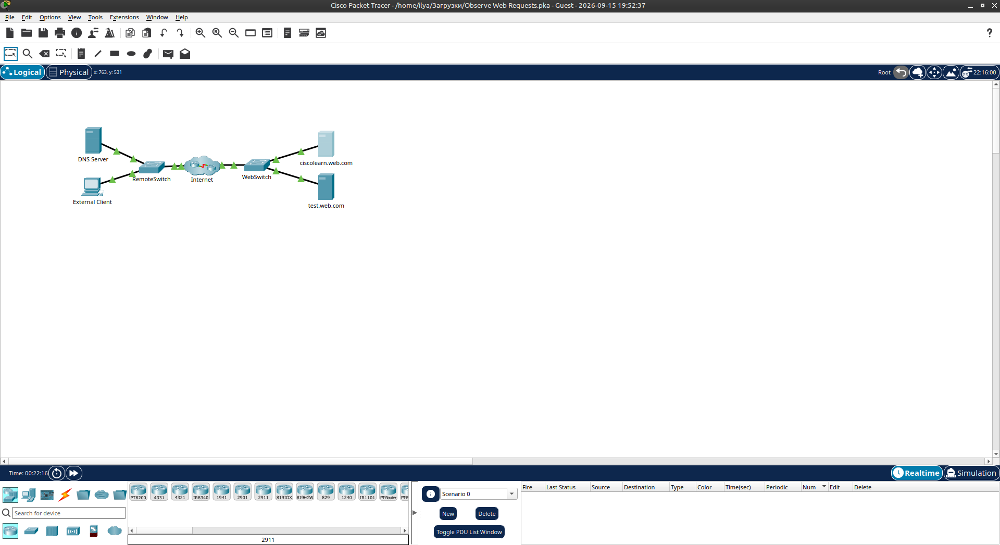
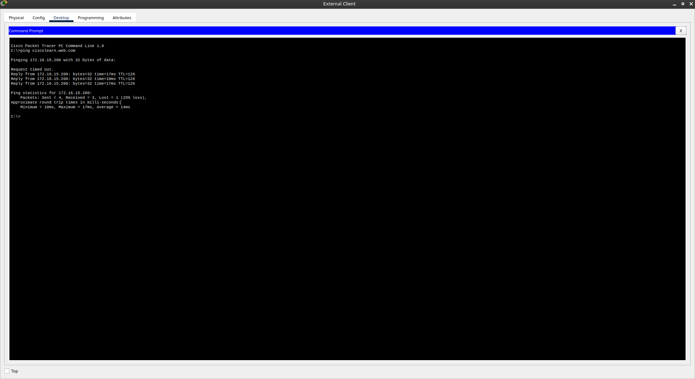
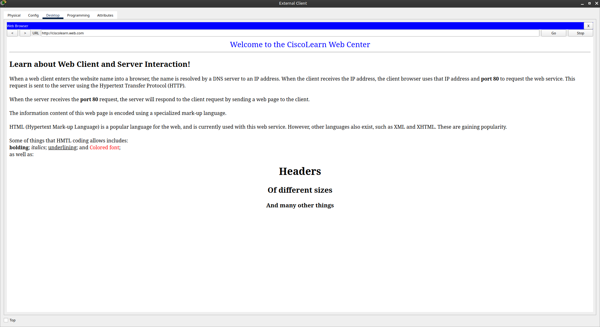
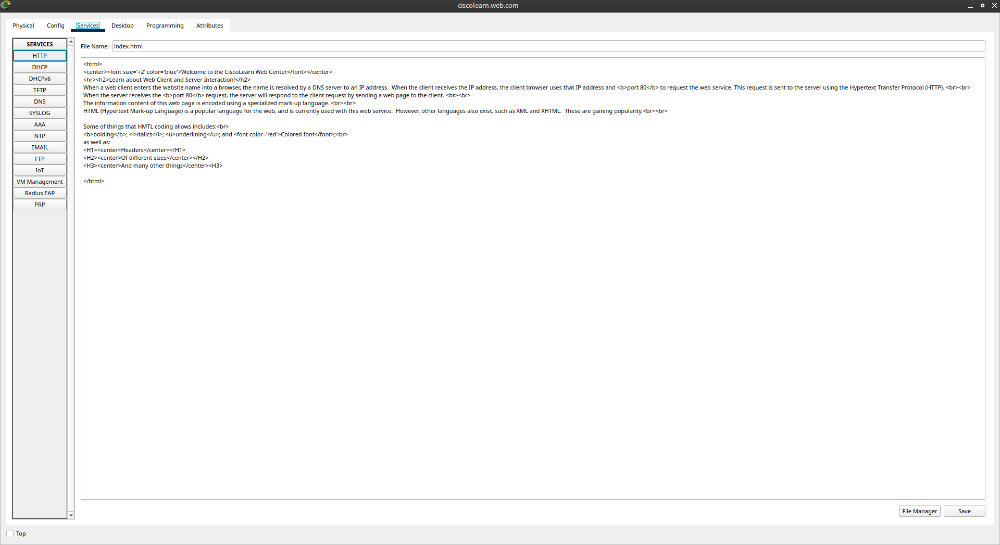
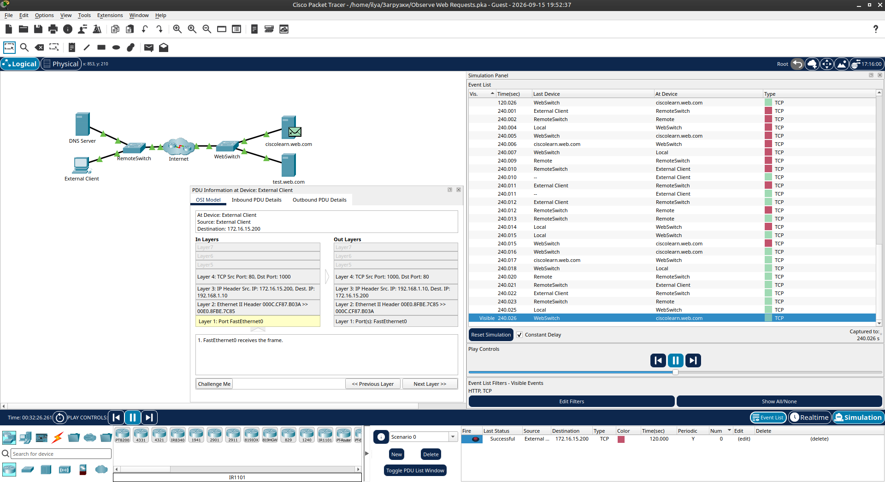

# Packet Tracer - Observe Web Requests

Лабораторная работа выполнена в **Cisco Packet Tracer**.

Цель работы — просмотреть трафик между клиентом и веб-сервером при запросе веб-страницы (DNS → HTTP/TCP).

## Топология сети

В лабораторной работе используются:

- External Client
- RemoteSwitch
- DNS Server
- Internet
- WebSwitch
- ciscolearn.web.com
- test.web.com



## 1. Проверка подключения к веб-серверу

На **External Client** в Command Prompt выполнен:

```text
ping ciscolearn.web.com
```

Имя разрешилось в IP-адрес **172.16.15.200**.



## 2. Подключение к веб-серверу

В Web Browser на External Client открыт адрес:

```text
http://ciscolearn.web.com
```

Страница успешно загрузилась:

**Welcome to the CiscoLearn Web Center**



## 3. Просмотр HTML-кода

На сервере **ciscolearn.web.com** открыта вкладка Services → HTTP → файл `index.html`.

Содержимое страницы написано на HTML (заголовки, форматирование текста, цвета).



## 4. Наблюдение трафика в Simulation

Включён режим **Simulation**.

Создан **Complex PDU**:

| Параметр              | Значение              |
|-----------------------|-----------------------|
| Application           | HTTP                  |
| Source                | External Client       |
| Destination           | ciscolearn.web.com    |
| Starting Source Port  | 1000                  |
| Periodic Interval     | 120 seconds           |

В Event List видны пакеты TCP/HTTP, проходящие через сеть.

В PDU Information:

| Уровень | Информация                                      |
|---------|-------------------------------------------------|
| Layer 4 | TCP (Src Port: 80 / 1000, Dst Port: 1000 / 80)  |
| Layer 3 | IP (Src: 172.16.15.200 ↔ Dest: 192.168.1.10)   |
| Layer 2 | Ethernet II                                     |
| Layer 1 | FastEthernet0                                   |



## 5. Результат

- ✅ Выполнен ping `ciscolearn.web.com` (получен IP 172.16.15.200)
- ✅ Открыта веб-страница в браузере
- ✅ Просмотрен HTML-код на сервере
- ✅ Создан Complex PDU и прослежен HTTP/TCP-трафик
- ✅ Проанализированы уровни OSI в PDU

## Полученные навыки

В ходе лабораторной работы были отработаны:

- проверка связности командой `ping` по доменному имени
- работа с веб-браузером в Packet Tracer
- просмотр HTML-кода на HTTP-сервере
- создание Complex PDU в режиме Simulation
- фильтрация событий (HTTP, TCP)
- анализ заголовков TCP и IP в PDU

## Используемые технологии

```text
Cisco Packet Tracer
DNS
HTTP
TCP
HTML
OSI Model
Complex PDU
```

## Итог

Лабораторная работа показывает полный путь запроса веб-страницы: разрешение имени через DNS, установление TCP-соединения и передача HTTP-данных между клиентом и сервером.

## Проблемы

- При первом ping часть пакетов может теряться (timeout).
- Буфер Simulation заполняется быстро — нужно нажимать **View Previous Events**.
