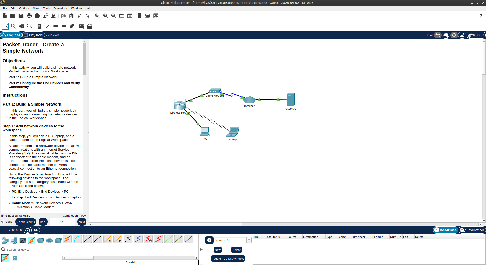
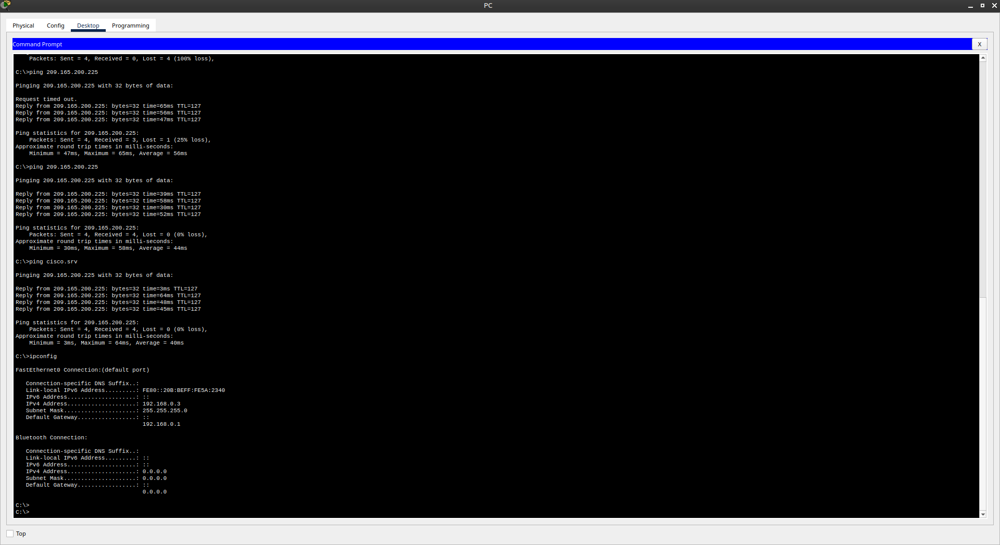

# Packet Tracer - Create a Simple Network

## Описание
Лабораторная работа Cisco Packet Tracer, в которой строится простая домашняя сеть с выходом в интернет.

## Топология
- PC (проводное подключение)
- Laptop (беспроводное подключение)
- Wireless Router
- Cable Modem
- Internet Cloud + сервер cisco.srv

## Что было сделано
- Добавлены и подключены устройства
- Настроен DHCP на Wireless Router
- PC получил адрес по DHCP
- Laptop переведён на беспроводной модуль WPC300N и подключён к сети HomeNetwork
- Проверена связность до cisco.srv (ping + веб-браузер)

## Результаты

**PC:**
- IP: 192.168.0.2
- Mask: 255.255.255.0
- Gateway: 192.168.0.1

**Проверка связности:**
- `ping 209.165.200.225` — успешно
- `ping cisco.srv` — успешно

## Что усвоил
- Разница между медным и коаксиальным кабелем
- Как работает DHCP в домашней сети
- Как подключать беспроводные устройства в Packet Tracer
- Базовая диагностика (почему роутер не получал WAN-адрес)

## Проблемы
- Проблема была в том, что Wireless Router долго не получал IP-адрес на стороне Internet (0.0.0.0). После IP Address Renew всё поднялось.
