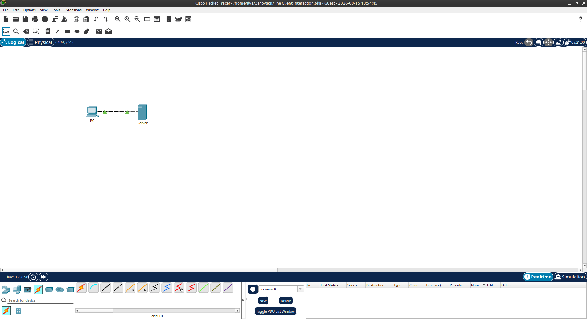
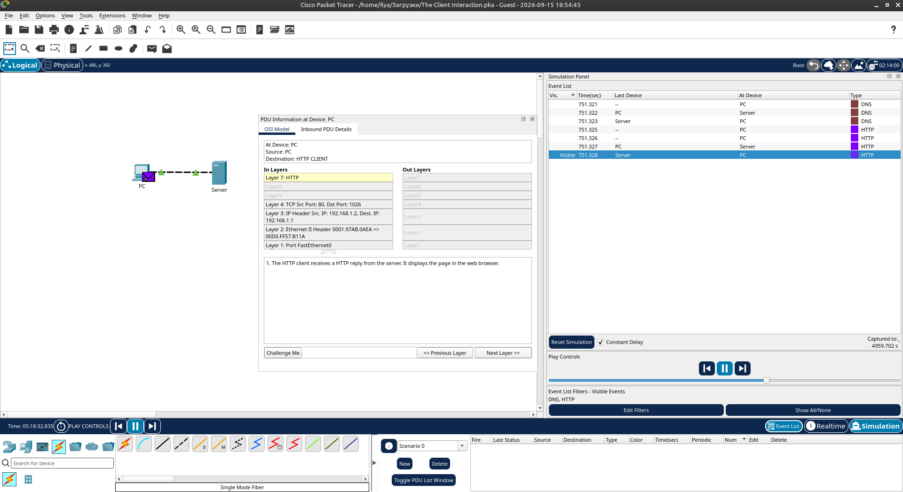
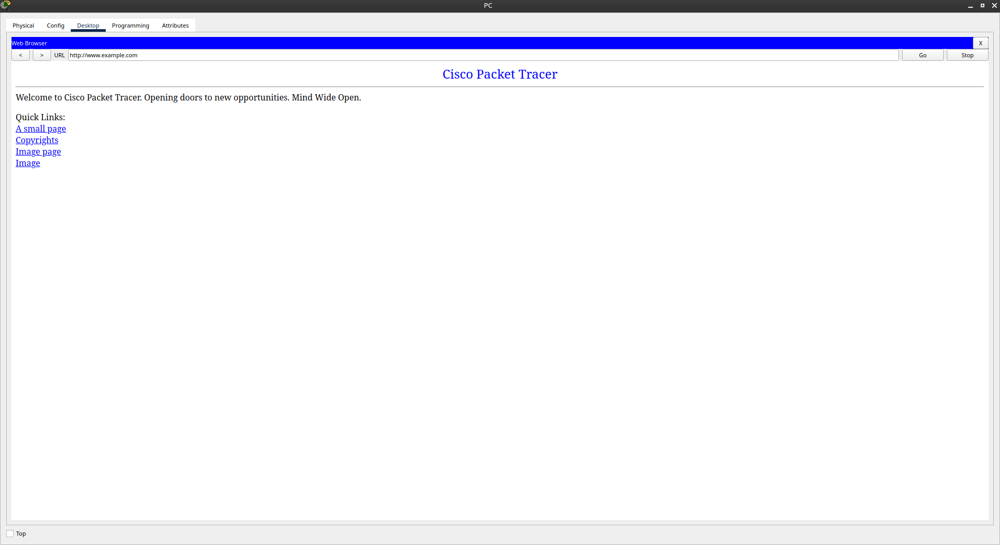

# Packet Tracer - The Client Interaction

Лабораторная работа выполнена в **Cisco Packet Tracer**.

Цель работы — проанализировать взаимодействие клиента (ПК) с сервером при запросе веб-страницы (DNS + HTTP).

## Топология сети

В лабораторной работе используются:

- PC
- Server

ПК напрямую подключён к серверу.



## 1. Вход в режим Simulation

Packet Tracer запускается в режиме Realtime. Для анализа трафика переключены в **Simulation mode**.

В фильтрах списка событий выбраны только:

- DNS
- HTTP

## 2. Запрос веб-страницы

На **PC** открыт Web Browser и введён адрес:

```text
http://www.example.com
```

После нажатия Go запущен процесс обмена данными.

## 3. Наблюдение трафика

В Simulation Panel видны события:

| Тип  | Описание                              |
|------|---------------------------------------|
| DNS  | Запрос преобразования имени в IP      |
| DNS  | Ответ сервера с IP-адресом            |
| HTTP | Запрос веб-страницы                   |
| HTTP | Ответ сервера с содержимым страницы   |

Процесс:

1. ПК отправляет DNS-запрос для `www.example.com`
2. Сервер отвечает IP-адресом
3. ПК отправляет HTTP-запрос
4. Сервер отправляет веб-страницу
5. ПК подтверждает получение

## 4. Анализ PDU

В окне **PDU Information** на уровне OSI видно:

| Уровень | Информация                                      |
|---------|-------------------------------------------------|
| Layer 7 | HTTP                                            |
| Layer 4 | TCP (Src Port: 80, Dst Port: 1026)              |
| Layer 3 | IP (Src: 192.168.1.2 → Dest: 192.168.1.1)       |
| Layer 2 | Ethernet II                                     |
| Layer 1 | FastEthernet0                                   |

Описание: *The HTTP client receives a HTTP reply from the server. It displays the page in the web browser.*



## 5. Результат в браузере

Веб-страница успешно загрузилась:

```text
Welcome to Cisco Packet Tracer. Opening doors to new opportunities. Mind Wide Open.
```



## 6. Результат

- ✅ Вошли в режим Simulation
- ✅ Настроены фильтры DNS и HTTP
- ✅ Запрошена веб-страница `www.example.com`
- ✅ Прослежен обмен DNS → HTTP
- ✅ Проанализированы уровни OSI в PDU
- ✅ Страница успешно отображена в браузере

## Полученные навыки

В ходе лабораторной работы были отработаны:

- работа в режиме Simulation Packet Tracer
- фильтрация событий (DNS, HTTP)
- понимание последовательности клиент-серверного взаимодействия
- роль DNS при обращении по имени
- анализ PDU по модели OSI
- просмотр HTTP-ответа в веб-браузере

## Используемые технологии

```text
Cisco Packet Tracer
DNS
HTTP
TCP/IP
OSI Model
Web Browser
```

## Итог

Лабораторная работа наглядно показывает, как клиент (ПК) взаимодействует с сервером: сначала происходит разрешение имени через DNS, затем запрос и получение веб-страницы по HTTP.

## Проблемы

- Без фильтров список событий заполняется слишком быстро.
- Необходимо нажать **View Previous Events**, когда буфер заполнен.
