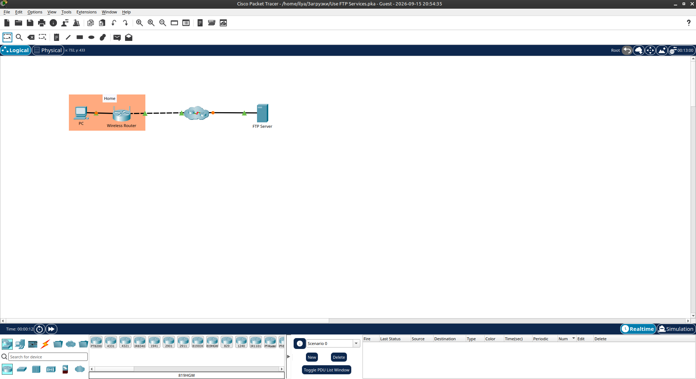

# Packet Tracer - Use FTP Services

Лабораторная работа выполнена в **Cisco Packet Tracer**.

Цель работы — использовать FTP-сервис: подключиться к серверу, загрузить файл, переименовать, скачать и удалить.

## Топология сети

В лабораторной работе используются:

- PC
- Wireless Router
- Internet (Cloud)
- FTP Server (`209.165.200.226`)



## 1. Подключение к FTP-серверу

На **PC** в Command Prompt выполнено:

```text
ftp 209.165.200.226
```

Учётные данные:

| Параметр | Значение   |
|----------|------------|
| Username | `student`  |
| Password | `cisco`    |

Успешное подключение:

```text
220- Welcome to PT Ftp server
230- Logged in
```


## 2. Загрузка файла на сервер

Локальный файл `sampleFile.txt` загружен командой:

```text
put sampleFile.txt
```

Результат:

```text
[Transfer complete - 26 bytes]
```

После загрузки файл появился в списке `dir`.


## 3. Переименование, скачивание и удаление

Выполнены команды:

```text
rename sampleFile.txt sampleFile_FTP.txt
get sampleFile_FTP.txt
delete sampleFile_FTP.txt
dir
quit
```

Результаты:

- Файл успешно переименован
- Файл скачан на ПК (26 bytes)
- Файл удалён с сервера
- Сессия FTP закрыта


## 4. Используемые FTP-команды

| Команда                          | Описание                        |
|----------------------------------|---------------------------------|
| `ftp 209.165.200.226`            | Подключение к серверу           |
| `dir`                            | Список файлов на сервере        |
| `put sampleFile.txt`             | Загрузка файла на сервер        |
| `rename old new`                 | Переименование файла            |
| `get sampleFile_FTP.txt`         | Скачивание файла с сервера      |
| `delete sampleFile_FTP.txt`      | Удаление файла с сервера        |
| `quit`                           | Выход из FTP-клиента            |

## 5. Результат

- ✅ Подключение к FTP-серверу `209.165.200.226`
- ✅ Загрузка файла `sampleFile.txt`
- ✅ Переименование в `sampleFile_FTP.txt`
- ✅ Скачивание файла на ПК
- ✅ Удаление файла с сервера
- ✅ Выход из FTP-сессии

## Полученные навыки

В ходе лабораторной работы были отработаны:

- подключение к FTP-серверу из Command Prompt
- аутентификация (username / password)
- загрузка файлов (`put`)
- скачивание файлов (`get`)
- переименование и удаление файлов на сервере
- просмотр содержимого каталога (`dir`)

## Используемые технологии

```text
Cisco Packet Tracer
FTP
TCP/IP
Command Prompt
```

## Итог

Лабораторная работа показывает базовые операции с FTP: подключение, загрузку, переименование, скачивание и удаление файлов.

## Проблемы

- Команда `dir'` (с кавычкой) выдаёт ошибку — нужно писать просто `dir`.
- После удаления файла он больше не отображается в списке `dir`.
