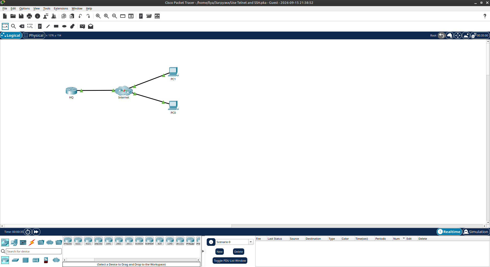
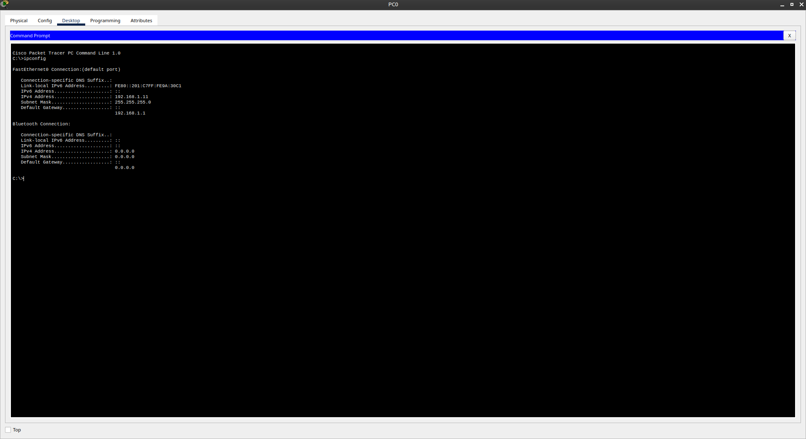
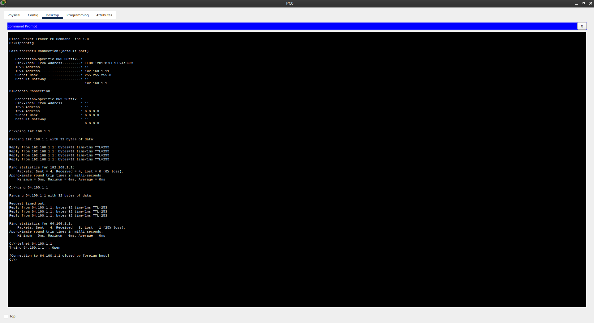
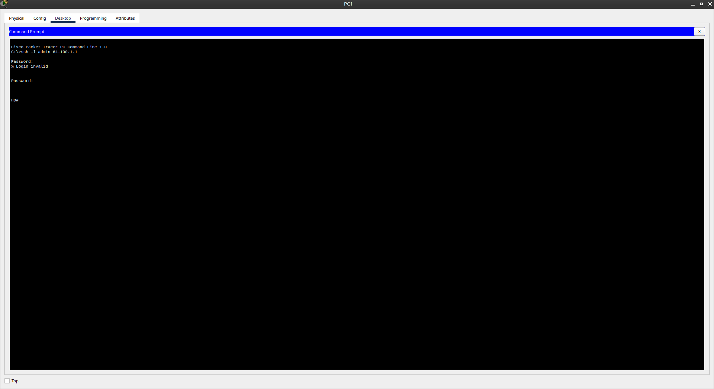

# Packet Tracer - Use Telnet and SSH

Лабораторная работа выполнена в **Cisco Packet Tracer**.

Цель работы — сравнить удалённый доступ к роутеру HQ через Telnet и SSH.

## Топология сети

В лабораторной работе используются:

- HQ (Router)
- Internet (Cloud)
- PC0
- PC1



## 1. Проверка IP-адресации

На **PC0** выполнен `ipconfig`:

| Параметр        | Значение          |
|-----------------|-------------------|
| IP Address      | `192.168.1.11`    |
| Subnet Mask     | `255.255.255.0`   |
| Default Gateway | `192.168.1.1`     |



## 2. Проверка связности

С PC0 выполнены ping:

```text
ping 192.168.1.1
ping 64.100.1.1
```

Оба адреса доступны (HQ — `64.100.1.1`).

## 3. Попытка подключения по Telnet

```text
telnet 64.100.1.1
```

Результат:

```text
Trying 64.100.1.1 ...Open
[Connection to 64.100.1.1 closed by foreign host]
```

**Telnet отклонён** — соединение закрыто удалённым хостом.



## 4. Подключение по SSH

С **PC1** выполнено:

```text
ssh -l admin 64.100.1.1
```

После ввода пароля успешно получен доступ:

```text
HQ#
```



## 5. Результат

| Способ доступа | Результат                          |
|----------------|------------------------------------|
| Telnet         | Соединение закрыто (отказано)      |
| SSH            | Успешный вход (`HQ#`)              |

- ✅ Проверена IP-адресация PC0
- ✅ Проверена связность с HQ
- ✅ Telnet к HQ отклонён
- ✅ SSH к HQ выполнен успешно

## Полученные навыки

В ходе лабораторной работы были отработаны:

- проверка IP-адресации (`ipconfig`)
- проверка связности (`ping`)
- попытка удалённого доступа по Telnet
- успешное подключение по SSH
- понимание, почему Telnet небезопасен и часто отключён

## Используемые технологии

```text
Cisco Packet Tracer
Telnet
SSH
IPv4
Command Prompt
```

## Итог

Лабораторная работа показывает разницу между Telnet и SSH: Telnet небезопасен и в данной сети отключён, а SSH позволяет безопасно управлять роутером удалённо.

## Проблемы

- Telnet всегда закрывается удалённым хостом — это ожидаемое поведение.
